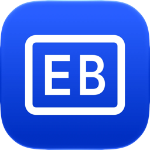

  

<h1 align="center">Testa tillägget</h1>

<a href="SETUP-EXTENSION.md" title="English">🇬🇧</a> &nbsp; <a href="SETUP-EXTENSION.sv.md" title="Svenska">🇸🇪</a>

Den här sidan kollar om Safari låter EuroBonus Finder köras på alla webbplatser.

## Felsökning

Händer inget?

Safari bestämmer var tillägg får köras. Så här tillåter du EuroBonus Finder överallt:

1. Leta efter pusselbitsikonen i Safaris adressfält. Tryck på den, välj
   **Tillåt alltid** och sedan **Tillåt alltid på alla webbplatser**.
2. Eller öppna **Inställningar › Appar › Safari › Tillägg › EuroBonus Finder**
   och ställ in **Andra webbplatser** på **Tillåt**.
3. En varningstriangel bredvid EuroBonus Finder i Safaris inställningar betyder
   att det inte är tillåtet överallt än.

Ladda sedan om den här sidan.

Bara den här webbplatsen?

Om sidan säger "Nästan framme" tillåter Safari tillägget här men inte på andra
webbplatser. Öppna **Inställningar › Appar › Safari › Tillägg › EuroBonus Finder**
och ställ in **Andra webbplatser** på **Tillåt**.

Fortfarande fast?

- Apples guide: [Hämta tillägg för att anpassa Safari på iPhone](https://support.apple.com/sv-se/102343)
- Mejla [support@pompa.se](mailto:support+ebfinder@pompa.se) så löser vi det.

